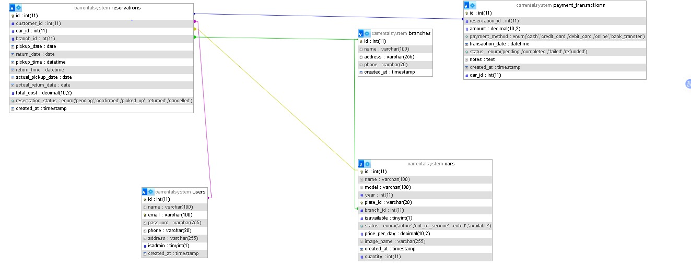

# Car Rental Management System

This repository contains a complete Car Rental Management System (demo-ready). The README below summarizes the project features, setup steps, and includes an Audit Report and ERD image section.

## Quick Start

- Import `final.sql` into your MySQL instance (phpMyAdmin or CLI).  
- Update `includes/config.php` with DB credentials (default: `localhost`, `root`, no password).  
- Place the project in XAMPP `htdocs`, start Apache & MySQL, then open `http://localhost/Car-Rental-Management-System/`.

## Demo Accounts

- Admin: `admin@carrental.com` / `admin123`  
- Test users: `ahmed@test.com`, `sara@test.com`, `mohamed@test.com` (password: `test123456`)

## Audit Summary

All project requirements have been verified and implemented. Key points:

- Car management (add/update/delete) with images and branch assignment.  
- Customer registration and secure login (bcrypt, CSRF, input validation).  
- Reservation lifecycle with double-booking prevention and branch support.  
- Advanced search (branch, year, price range, model).  
- Payments linked to reservations and transaction records.  
- Four admin reports available at `admin/advanced_reports.php`.  
- Database schema follows 3NF with proper PKs, FKs, UNIQUE and CHECK constraints.

See `AUDIT_REPORT.md` for the full audit.

## Admin Features Added

- `admin/users.php`: list users, toggle admin, delete user (CSRF protected).  
- `admin/updatecar.php`: update car status/price and delete car (checks for active reservations and removes uploaded image).  
- Admin navigation updated to include "Manage Users".

## ERD (Entity Relationship Diagram)

Add your ERD image to `img/erd.png` (recommended size ~1200px width). The README will display it automatically if present:

If you don't yet have an ERD image, export one from your database modeling tool and save it as `img/erd.png`.

---

For a detailed audit and implementation notes, see `AUDIT_REPORT.md` in the project root.
